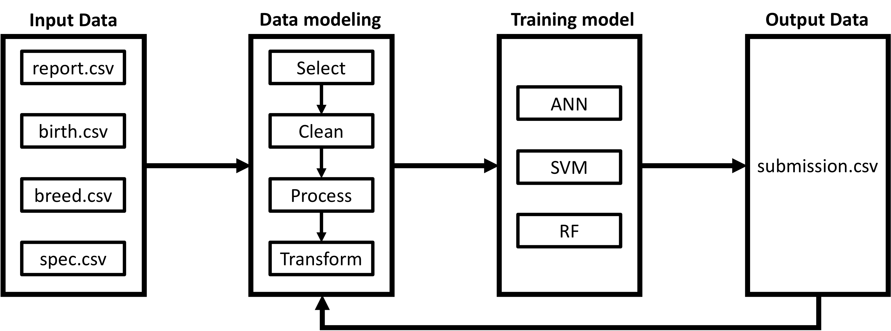
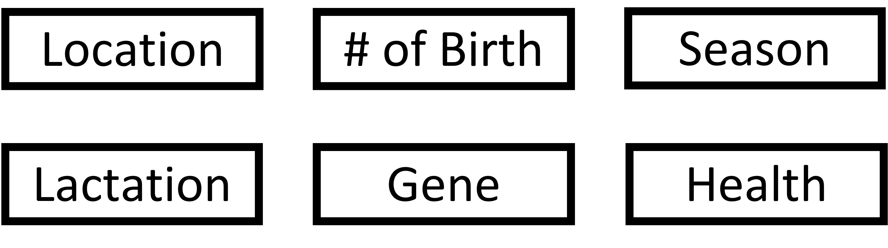
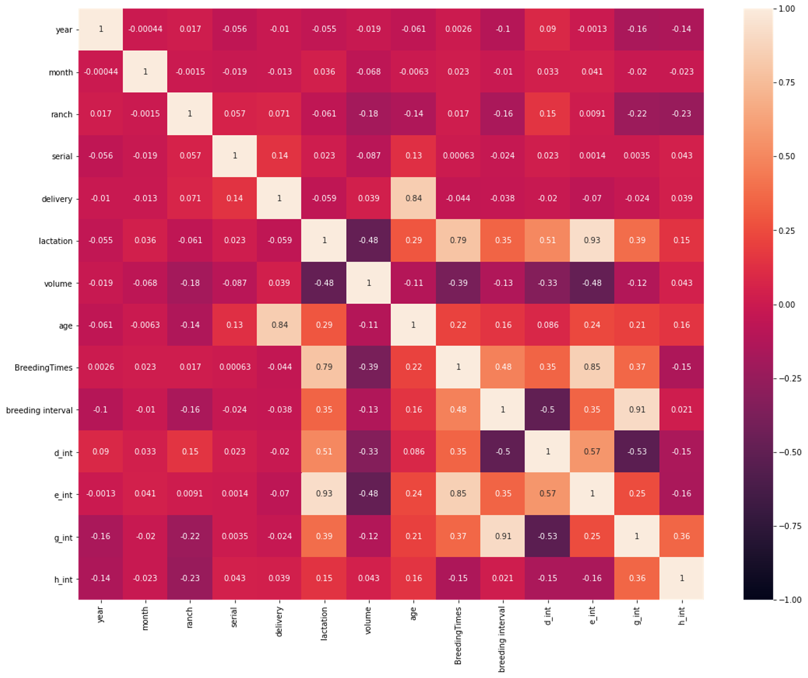
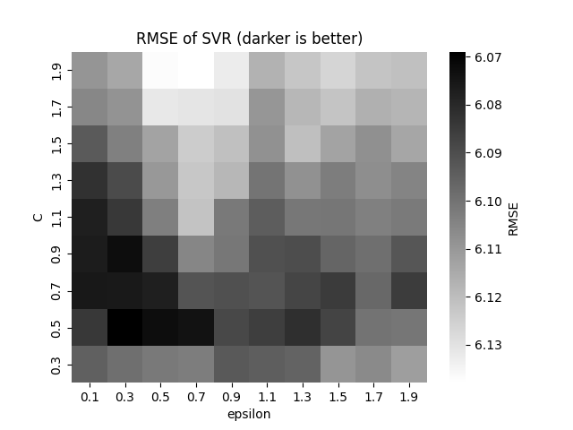

# Milk Yield Prediction

## Abstract

We attempt to predict milk production based on ID numbers that correspond to different cows under certain conditions. We will perform preliminary processing of the data using several data modeling (DM) methods. Afterward, we introduce three models to address this problem, which are Artificial Neural Network (ANN), Support Vector Regression (SVR), and Random Forest (RF). To quantitatively evaluate the results, we introduce the root mean square error (RMSE) formula as an indicator, which is the same as that given by the subject provider. This project will consist of six main steps. They are data pre-processing, model training, Model validation and parameter tuning, testing and Performance analysis.

## Introduction

As Figure 1 shows, the data were initially verified before further processing. We have more than 20 features for a record, and some features were poorly managed. We thus suspect that some records might contain errors, and those should not be included in the training data. Therefore, we compared features of each record and dropped the records with conflict before preprocessing.

In data modeling, features were encoded and transformed such that the output features contain only numbers, and options were provided to drop features or modify encoding methods for different models.

The mined data would be sent to three models, ANN, SVR and RF. The reason for choosing these three models is that they are state-of-the-art in the agriculture field and are well discussed in recent articles[^1]. We would verify the usefulness of features by using options provided by data modeling. After that, the models were refined by using different parameters.

## Methods

### Data Verifying

The following things were checked:

1. The age of a cow should agree with the sampling date and the birthday.
2. The sampling date should be no later than the recording date.
3. The number of days of lactation should agree with the sampling date and the last delivery date.
4. The birthday recorded in the "report" should agree with the one in the "birth".
5. A cow should have exactly one birthday.
6. The serial number of a cow should not appear in the "report" after it died.
7. Cows with ages less than 21 months should not be on the "report".
8. The number of deliveries should be less or equal to the number of breedings.

### Data Modeling

In the data modeling part, we began with finding the key factors that would significantly affect the production of milk. The article[^2] published in the journal of Dairy Science shows that six features shown in Figure 2 would significantly affect the milk yield. The features include lactation of the ranch, number of birth, yield season, lactation days, cow$'$s gene and the healthiness of cows.

We extracted features related to the above six features. As some features are in string format, we encoded the data with different encoding methods as well.

We also appended some new features based on the observation of the data. For example, we appended the mean and the stander deviation (std) of the milk yield of a cow within a lactation period, as we know the milk yield is relatively stable within a lactation period of a cow.

The appended features, however, would make the data with missing values. If the appended features were used, a trick is used. We trained the model without appended features first, and we trained another model with appended features. If a test data has missing values in appended features, we used the first model; otherwise, we used the second one.

### Training Model

The models were trained by different features and parameters.

To verify the models, two methods were used. One was using 10 random validation sets, and we denoted the average RMSE as Average RMSE. The other method used data sampling between 2018/01/01 to 2018/06/30 as the validation set, and we denoted the corresponding RMSE as Special RMSE.

#### Select Features

We first used different features and encoding methods to verify the usefulness of features. To verify the usefulness of features, sets of parameters for models were used. 

For ANN, we used 3 hidden layers with hidden neurons 150, 100 and 50. Rectified linear unit (Relu) was chosen as the activation function for the network. Adam optimizer was selected with 50 max iterations. 

For RF, the number of estimators was 1000, with the criterion set to be squared error.

For SVR, epsilon and cost were set to be 0.1, 1 respectively.

We also picked the min-max scaler as the features scaler, as we found not all the features were normally distributed.

#### Select Parameters

Given the selected features and encoding methods, we do some experiments on different settings of models. 

For SVR, we mainly focus on different epsilon and cost for the Radial basis function kernel. Different kernels, such as the sigmoid kernel, were tested as well.

For ANN, we focus on different numbers of hidden layers, as we were curious about the underfitting/overfitting problem.

## Result

### Data Verifying

After examining the verifying result, the following data were dropped:
- ID = 6960: sampling date > recoding date.
- ID = 16714: missing important features.
- Data with cows$'$ ages less than 21 months.
- Data with milk yield equal to 0.

The cows with the following serial numbers were recorded to be dead in the "spec", yet they appear in the "report" later:
- 98051976
- 94051730
- 97051412

After a quick check, we believed that the serial number would be reused on some occasions. As a result, we would not adopt data in the "spec" before further review.

In the process, we also found that the data in columns 16 to 21 in the "report" does not match the official meaning. In column 18, the official description is "number of breeding", yet we found lots of records have 0 in this column. In column 16, the official description is "last breeding date", yet it might be later than the recording date of the record. However, the time intervals calculated by these features proved to be valuable later. As a result, we can only suggest that the descriptions are misleading.

<!-- There are 33252 training data with 1821 cows and 4263 test data with 846 cows. For the 846 cows in the test dataset, 679 of them can be found in training data, while 170 of them cannot. -->

### Data Modeling

As shown in Figure 3, we compare all the features with a heat map. The result shows that the selected six features have a relatively low correlation to other features, which means these six features could independently affect the training model.

<!-- We only use data in report.csv, as we cannot get the mother's ID (col 6) from birth.csv (no corresponding calf serial can be found). Consequently, we cannot get the father's ID (col 7) from breed.csv. -->

<!-- Define features' name and meaning here -->

<!-- Define how does label encoding work on serial. It used birthday. -->

### Training Models

#### Select Features

##### ANN

We first used ANN to verify different encoding methods and features. Starting from the following features:

| feature   | preprocessing     |
|-----------|-------------------|
| year      |                   |
| month     |                   |
| ranch     | label encoded     |
| serial    | based on birthday |
| father    | frequency encoded |
| mother    | frequency encoded |
| delivery  |                   |
| lactation |                   |
| age       |                   |

We tried to change the encoding methods of the serial and the ranch, and we tried to provide more features to ANN.

|                          | Test 1 | Test 2 | Test 3 | Test 4 | Test 5 | Test 6 |
|--------------------------|--------|--------|--------|--------|--------|--------|
| Frequency encoded serial | X      | O      | O      | O      | O      | O      |
| One-hot encoded ranch    | X      | X      | O      | O      | O      | O      |
| Add breeding             | X      | X      | X      | O      | O      | O      |
| Add delivery season      | X      | X      | X      | X      | O      | O      |
| Add time intervals       | X      | X      | X      | X      | X      | O      |
|                          |        |        |        |        |        |        |
| Average RMSE             | 6.092  | 6.014  | 5.988  | 5.931  | 5.976  |        |
| Special RMSE             | 5.837  | 5.810  | 5.837  | 5.871  | 5.825  |        |
| Real RMSE                |        |        |        |        | 6.274  | 6.257  |

In the process, we found out that max_iter is a key factor for the result. For different sets of features, the ideal max_iter varies, which makes it hard to determine the usefulness of features.

Moreover, for the special (fixed) validation set, the result varied with time. The above table took the mean of 10 runs. Therefore, we hoped the Random Forest Regressor can give us clear views.

##### Random Forest Regressor

The Random Forest Regressor takes much longer to compute, but it will give us the same result as long as the random state is fixed. As a result, the special validation set was used as we found out it can better descript the real test set. 

We tried to find the usefulness of features first this time. The ranch was set to use label encoding and the frequency encoding was used for serial.

|                     | Test 1 | Test 2 | Test 3 | Test 4 |
|---------------------|--------|--------|--------|--------|
| Add breeding        | X      | O      | O      | O      |
| Add delivery season | X      | X      | O      | O      |
| Add time intervals  | X      | X      | X      | O      |
|                     |        |        |        |        |
| Average RMSE        | 5.505  | 5.392  | 5.346  |        |
| Special RMSE        | 5.764  | 5.709  | 5.689  |        |
| Real RMSE           | 6.303  | 6.260  | 6.242  | 6.242  |

We found that the delivery season and data in columns 16 to 21 are meaningful to milk yield.

We then try different encoding methods for serial and ranch. When frequency encoding was not used for serial, we use the birthday to rank the serial.

|                          | Test 1 | Test 2 | Test 3 |
|--------------------------|--------|--------|--------|
| Frequency encoded serial | O      | O      | X      |
| One-hot encoded ranch    | O      | X      | X      |
| Add breeding             | O      | O      | O      |
| Add delivery season      | O      | O      | O      |
|                          |        |        |        |
| Special RMSE             | 5.689  | 5.689  | 5.980  |

We found that the frequency encoded serial is necessary. We also suspected that the cows are not getting better from generation to generation, which is more alarming.

##### SVR

We tried to verify the discovery with SVR.

|                          | Test 1 | Test 2 | Test 3 | Test 4 | Test 5 | Test 6 | Test 7 | Test 8 | Test 9 |
|--------------------------|--------|--------|--------|--------|--------|--------|--------|--------|--------|
| Frequency encoded serial | X      | O      | O      | O      | O      | O      | O      | O      | O      |
| One-hot encoded ranch    | X      | X      | O      | O      | O      | X      | X      | X      | X      |
| Add breeding             | X      | X      | X      | O      | O      | O      | O      | X      | O      |
| Add delivery season      | X      | X      | X      | X      | O      | O      | X      | O      | O      |
| Add time intervals       | X      | X      | X      | X      | X      | X      | X      | X      | O      |
|                          |        |        |        |        |        |        |        |        |        |
| Average RMSE             | 6.435  | 6.331  | 6.394  | 6.405  | 6.330  | 6.209  | 6.282  | 6.256  |        |
| STD RMSE                 | 0.079  | 0.089  | 0.082  | 0.064  | 0.063  | 0.063  | 0.073  | 0.073  |        |
| Real RMSE                |        |        |        |        |        | 6.524  |        |        | 6.389  |

The result of adding more features was less obvious but still agreed with the discovery above. As for the one-hot encoding, we suspected that SVR does not prefer too many dimensions, and the hyperplane might be complex enough.

#### Select Parameters

##### SVR

With the correct features and encoding, we first tried out different kernels. The results were far from the default kernel (RBF). The default gamma also worked better. Then, we tried different epsilon and cost to control the number of support vectors and the hardness of the margin. After a quick check, we set the experiment range of epsilon and cost to be 0.1 ~ 1.9.

The result suggested that it might not be worth taking time on refining SVR. We apply 10 random validation sets on the SVR using epsilon = 0.4 with cost = 0.9, and the result was no better than the one using default values.

##### ANN

Disappointed by SVR, we turned our view to ANN.

The network was tuned by varying numbers of neurons in each hidden layer. Additional experiments with different network structures (two hidden layers and four hidden layers) are also carried out. The experimental results from some selected network architectures are summarized.

| Model          | 2 layers  | 2 layers   | 3 layers       | 3 layers        | 4 layers            |
|----------------|-----------|------------|----------------|-----------------|---------------------|
| Hidden neurons | (50, 50)  | (150, 150) | (150, 100, 50) | (150, 150, 100) | (150, 150, 100, 50) |
| Random RMSE    | 6.0941915 | 5.9412459  | 5.8721048      | 5.6119093       | 5.5645772           |
| Real RMSE      | 6.0836847 | 5.9471910  | 6.6491903      | 7.3698958       | 9.2742763           |

The RMSEs of some network configurations are noticeably lower than the others. The prediction results of these networks, however, got higher RMSEs in the online evaluation. The structure of these networks basically contains more neurons and/or more hidden layers than the others. Therefore, it can be said that these networks are slightly overfitting models.

For further improvement of the prediction results, preprocessing part of the project seems to be more important. And some important information was missing in the current training data, such as the weight of cows, twin or single calves, etc.

## Conclusion

In comparison with other teams, our RMSE value is relatively high. We believe that if we can finish the work on appending more features such as health-related or symptom-related features, the result would be better. Moreover, we did not systematically refine the RF model, which ironically gave us the best result in the end. We do have the confidence to get just below 6 if we refine the RF model. Therefore, we prepared a relatively simple code for others to build on.

We are also surprised by the fact that serial numbers ranked by birthday do not contribute to the result. This might suggest that cows are not getting better, and it should be a major concern for ranchers.

## Reference

[^1]: A. M. Jiménez-Carvelo, S. Bikrani, M. Nechar, B. Souhail, and L. Cuadros-Rodríguez, “Chapter12 - machine learning-based chemometric methods for quality and authentication of milk and dairy products,” in Dairy Foods, A. G. da Cruz, C. S. Ranadheera, F. Nazzaro, and A. M. Mortazavian, Eds. Woodhead Publishing, 2022, pp. 261–280. [Online]. Available: https://www.sciencedirect.com/science/article/pii/B978012820478800002X

[^2]: R. Rearte, S. LeBlanc, S. Corva, R. de la Sota, I. Lacau-Mengido, and M. Giuliodori, “Effect of milk production on reproductive performance in dairy herds,” Journal of Dairy Science, vol. 101, no. 8, pp. 7575–7584, 2018. [Online]. Available: https://www.sciencedirect.com/science/article/pii/S00220302183051257
